# Instrumented NodeJS Application

This NodeJS application built using the NestJS framework has been instrumented
with OpenTelemetry and integrated with Zipkin and Prometheus for trace and
metrics visualization, respectively.

## Table of Contents

- [Instrumented NodeJS Application](#instrumented-nodejs-application)
- [Running the App](#running-the-app)
- [Access the NodeJS Application, Traces, and Metrics](#access-the-nodejs-application-traces-and-metrics)
- [Use the NodeJS Application](#use-the-nodejs-application)
- [Example Usage with Traces](#example-usage-with-traces)
- [Example Metrics](#example-metrics)
- [Report](#report)

## Running the App

To run this project you will need to have Docker installed and running on your
system.

### VS Code Dev Containers

The work for this project was done in a VS Code Dev Container. 

Download and install VS Code and the VS Code Dev Containers extension, both
from Microsoft.

- [VS Code Editor](https://code.visualstudio.com)
- [Dev Containers Extension](https://marketplace.visualstudio.com/items?itemName=ms-vscode-remote.remote-containers)

Open this project in VS Code then type `cmd + shift + p` (mac) or `ctrl + shift + p`
(windows/linux) and type/select from the menu: `Dev Containers: Rebuild and Reopen in Dev Container`.

Completing the above steps will download and install the containers required
to run the NodeJS application and Prometheus and ZipKin.

Once the project has re-opened, type `cmd + ~` (mac) or `ctrl + ~` (windows/linux)
to open the terminal. The terminal will open inside the app container in the
application's working directory.

Run the following commands to start the NodeJS application:

```
npm install
npm run build
npm start:prod
```

Prometheus and ZipKin will already be running.

Learn more about Dev Containers in this article on
[Developing inside a Container](https://code.visualstudio.com/docs/devcontainers/containers).

### Docker (Alternative Instructions)

```
docker-compose -f ./devcontainer/docker-compose.yml up
```

Once the containers are up, ssh into the app container.

```
docker-compose -f ./devcontainer/docker-compose.yml exec app /bin/bash
```

Change into the project directory, install dependencies, build, then run
the app.

```
cd /workspaces/todo-list
npm install
npm run build
npm run start:prod
```

## Access the NodeJS Application, Traces, and Metrics

Visit the following sites in your web browsers:

<table>
  <thead>
    <tr>
      <th>App</th>
      <th>URL</th>
    </tr>
  </thead>
  <tbody>
    <tr>
      <td>NodeJS App</td>
      <td>
        <a href="http://localhost:3000">
          http://localhost:3000
        </a>
      </td>
    </tr>
    <tr>
      <td>Zipkin</td>
      <td>
        <a href="http://localhost:9411/">
          http://localhost:9411/
        </a>
      </td>
    </tr>
    <tr>
      <td>Prometheus</td>
      <td>
        <a href="http://localhost:9090">
          http://localhost:9090
        </a>
      </td>
    </tr>
  </tbody>
</table>

## Use the NodeJS Application

Use the following commands to exercise the NodeJS application from the terminal.

### Get tasks

```
curl http://localhost:3000/tasks
```

### Create task

In the example below, replace "your description" with a description of your
choosing.

```
curl http://localhost:3000/tasks -X POST \
  -d '{"description": "your description"}' \
  -H 'Content-Type: application/json'
```

### Get task

In the example below, replace "1" with an id of an existing task.

```
curl http://localhost:3000/tasks/1
```

### Update task

In the example below, replace "1" with an id of an existing task.
You can an update the description and/or status.

```
curl http://localhost:3000/tasks/1 -X PATCH \
  -d '{"status": "DONE"}' \
  -H 'Content-Type: application/json'
```

### Delete task

```
curl http://localhost:3000/tasks/1 -X DELETE
```

## Example Usage with Traces

### GET Tasks with Trace

```
$ curl http://localhost:3000/tasks

[{"id":4,"description":"your descrition","status":"OPEN"},{"id":5,"description":"your description","status":"OPEN"}]
```

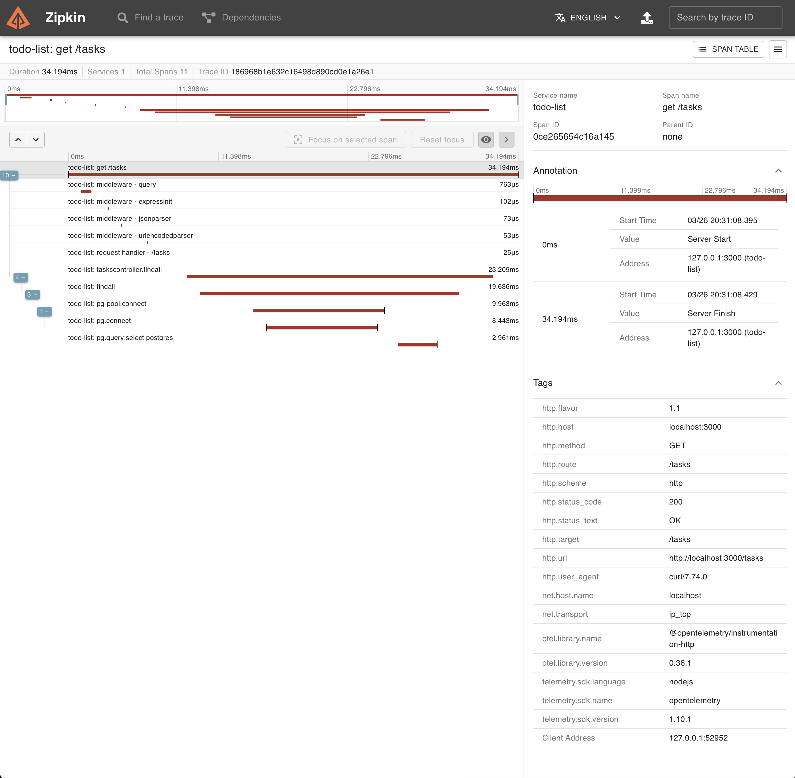

### Create Task with Trace

```
$ curl http://localhost:3000/tasks -X POST \
  -d '{"description": "Pick up stuff at the store"}' \
  -H 'Content-Type: application/json'

{"description":"Pick up stuff at the store","status":"OPEN","id":6}
```

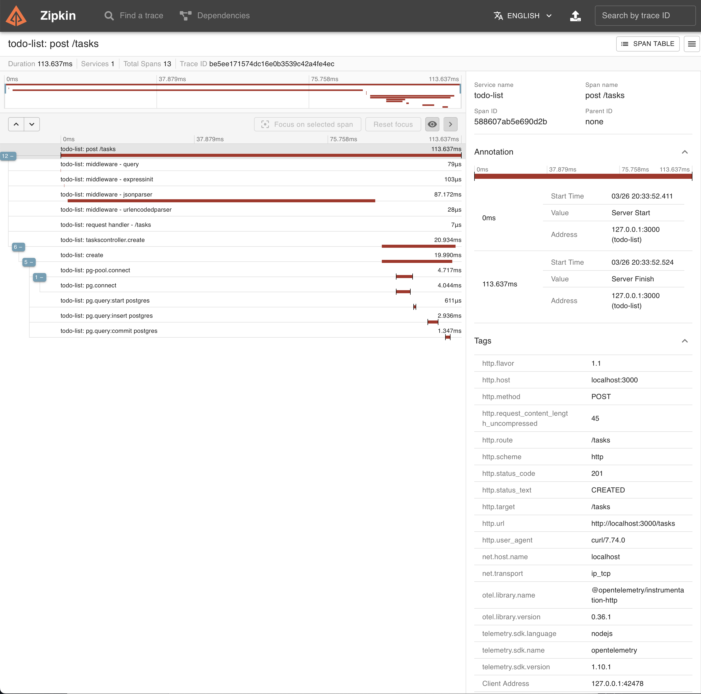

### Get Task with Trace

```
$ curl http://localhost:3000/tasks/6

{"id":6,"description":"Pick up stuff at the store","status":"OPEN"}
```

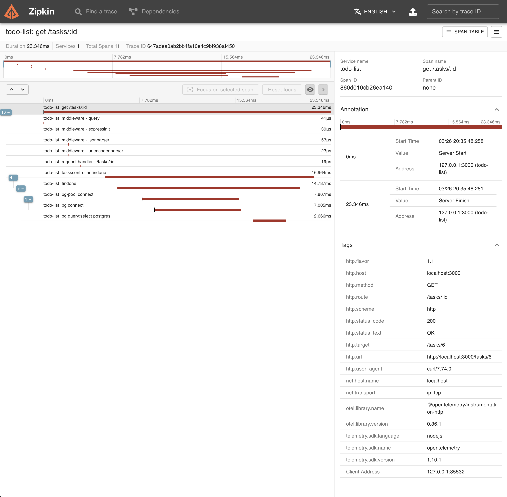

### Patch Task with Trace

```
$ curl http://localhost:3000/tasks/6 -X PATCH \
  -d '{"status": "DONE"}' \
  -H 'Content-Type: application/json'

{"id":6,"description":"Pick up stuff at the store","status":"DONE"}
```

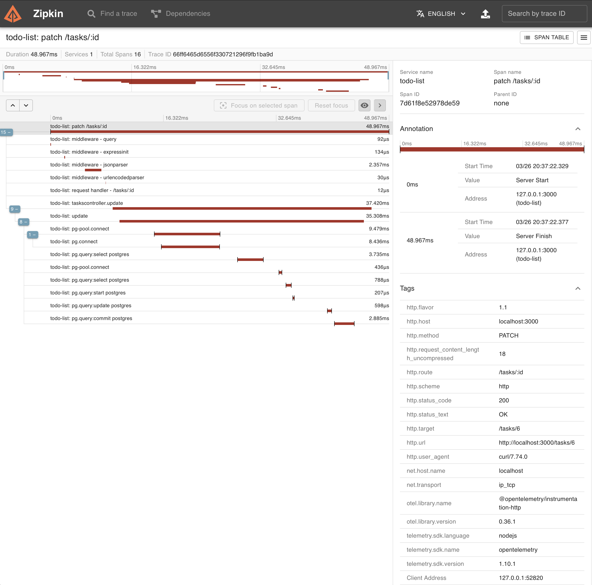

As an example of what other information can be gathered from the trace logs,
here is a screenshot with the PG query span selected. The database query that
was exected can be seen (`UPDATE "task" SET "status" = $1 WHERE "id" IN ($2)`).

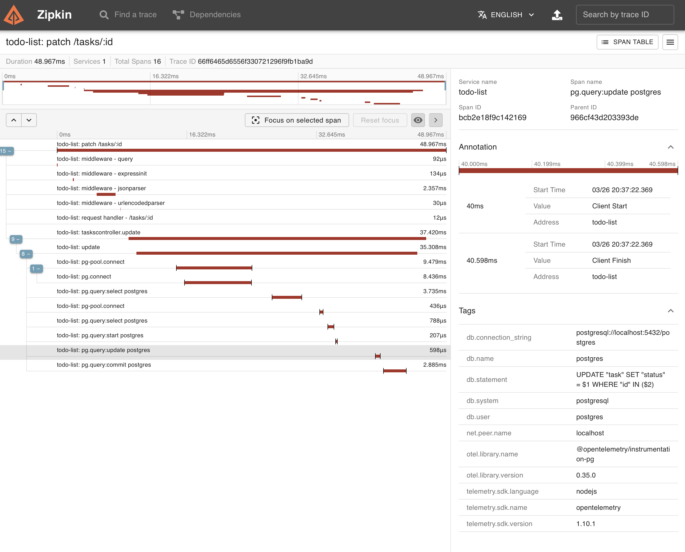

### Delete Task with Trace

```
$ curl http://localhost:3000/tasks/6 -X DELETE
```

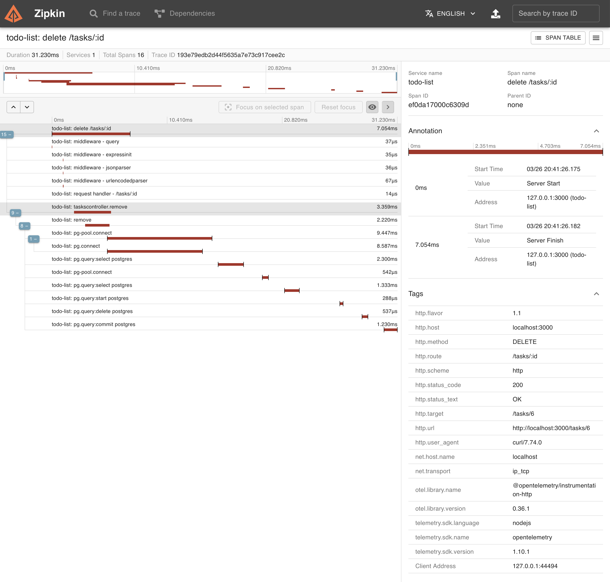

### Get Tasks with Error and Trace

To demonstrate that the last operation worked and to trace an error.

```
$ curl http://localhost:3000/tasks/6

{"statusCode":404,"message":"Task #6 not found","error":"Not Found"}
```

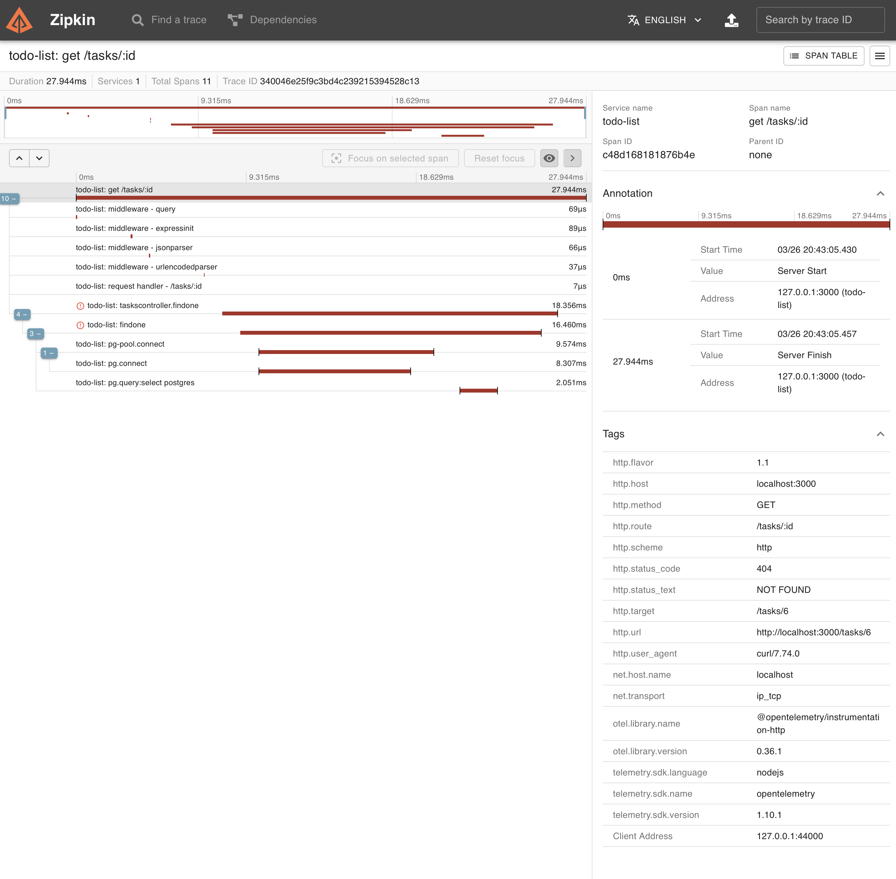

Note: in the list of results, the error is displayed with a red bar line.

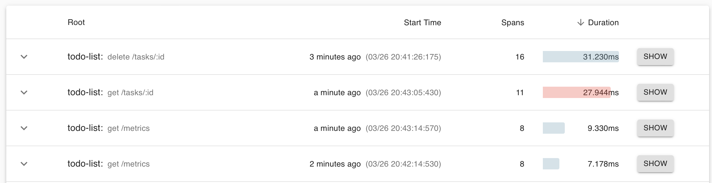

## Example Metrics

Below are screenshots of metrics collected.

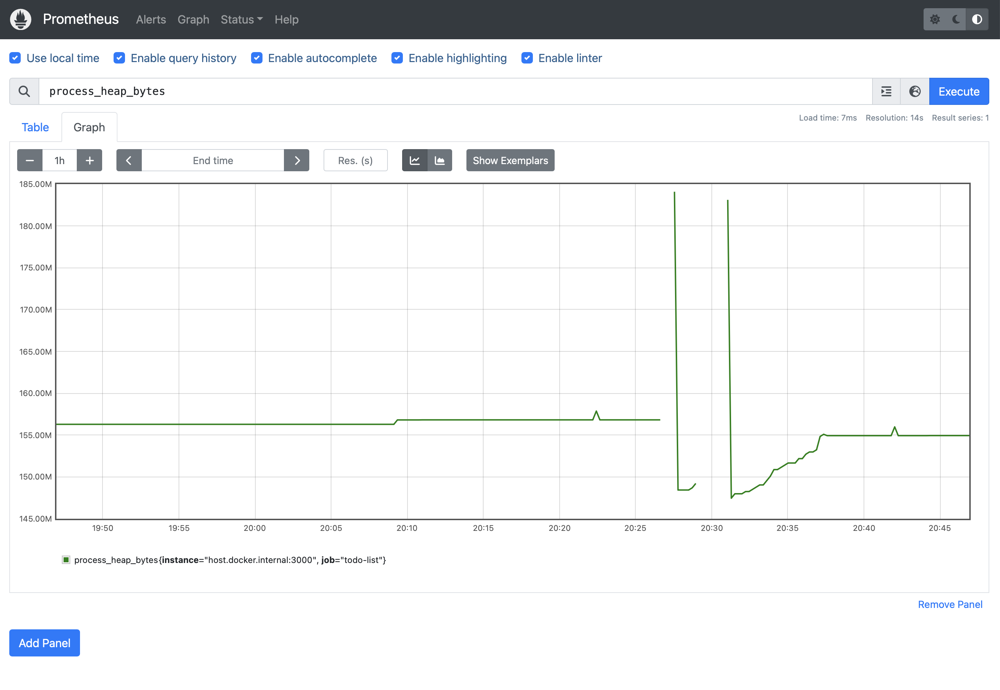

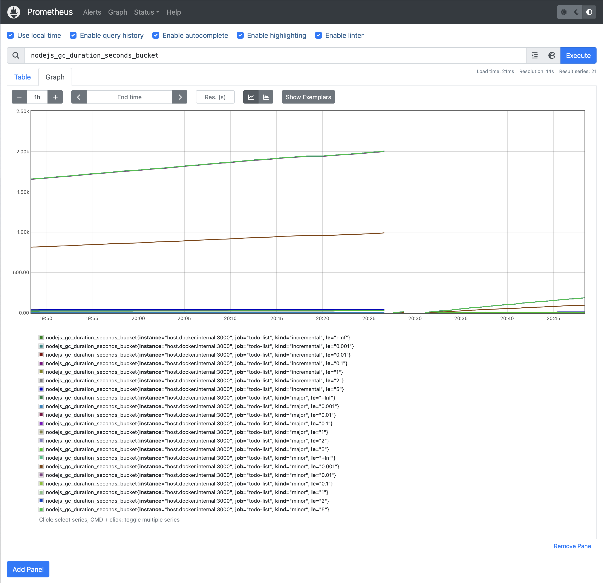

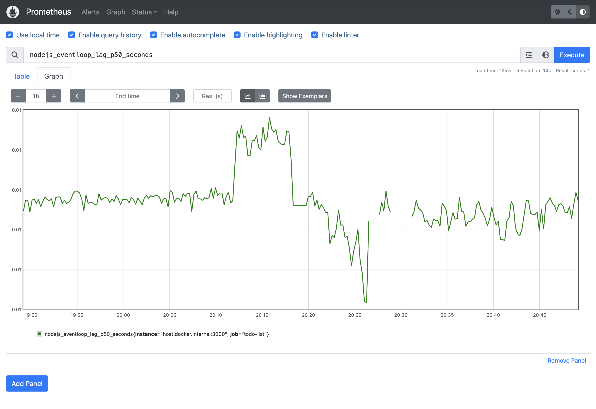

## Report

This todo list API was built in TypeScript with NestJS -- a backend NodeJS
framework built on top of Express. It is a simple application that was built
to experiment with integrating opentelemetry for collecting traces and metrics,
as well as piping the trace and metric logs visualization platforms.

