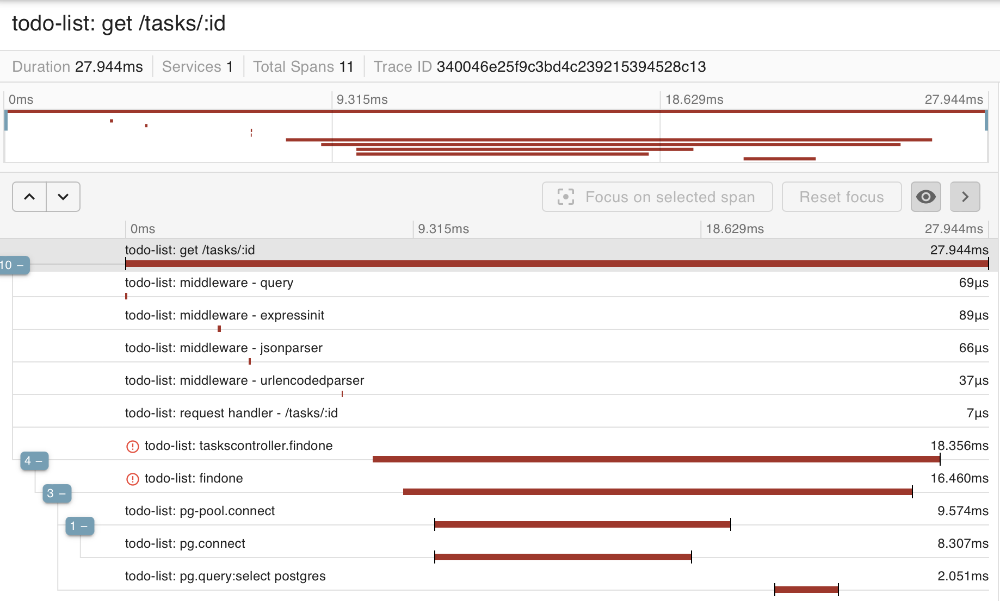

# Instrumented NodeJS Application

This NodeJS application built using the NestJS framework has been instrumented
with OpenTelemetry and integrated with Zipkin and Prometheus for trace and
metrics visualization, respectively.

## Table of Contents

- [Instrumented NodeJS Application](#instrumented-nodejs-application)
- [Running the App](#running-the-app)
- [Access the NodeJS Application, Traces, and Metrics](#access-the-nodejs-application-traces-and-metrics)
- [Use the NodeJS Application](#use-the-nodejs-application)
- [Example Usage with Traces](#example-usage-with-traces)
- [Example Metrics](#example-metrics)
- [Report](#report)

## Running the App

To run this project you will need to have Docker installed and running on your
system.

### VS Code Dev Containers

The work for this project was done in a VS Code Dev Container. 

Download and install VS Code and the VS Code Dev Containers extension, both
from Microsoft.

- [VS Code Editor](https://code.visualstudio.com)
- [Dev Containers Extension](https://marketplace.visualstudio.com/items?itemName=ms-vscode-remote.remote-containers)

Open this project in VS Code then type `cmd + shift + p` (mac) or `ctrl + shift + p`
(windows/linux) and type/select from the menu: `Dev Containers: Rebuild and Reopen in Dev Container`.

Completing the above steps will download and install the containers required
to run the NodeJS application and Prometheus and ZipKin.

Once the project has re-opened, type `cmd + ~` (mac) or `ctrl + ~` (windows/linux)
to open the terminal. The terminal will open inside the app container in the
application's working directory.

Run the following commands to start the NodeJS application:

```
npm install
npm run build
npm start:prod
```

Prometheus and ZipKin will already be running.

Learn more about Dev Containers in this article on
[Developing inside a Container](https://code.visualstudio.com/docs/devcontainers/containers).

### Docker (Alternative Instructions)

```
docker-compose -f ./devcontainer/docker-compose.yml up
```

Once the containers are up, ssh into the app container.

```
docker-compose -f ./devcontainer/docker-compose.yml exec app /bin/bash
```

Change into the project directory, install dependencies, build, then run
the app.

```
cd /workspaces/todo-list
npm install
npm run build
npm run start:prod
```

## Access the NodeJS Application, Traces, and Metrics

Visit the following sites in your web browsers:

<table>
  <thead>
    <tr>
      <th>App</th>
      <th>URL</th>
    </tr>
  </thead>
  <tbody>
    <tr>
      <td>NodeJS App</td>
      <td>
        <a href="http://localhost:3000">
          http://localhost:3000
        </a>
      </td>
    </tr>
    <tr>
      <td>Zipkin</td>
      <td>
        <a href="http://localhost:9411/">
          http://localhost:9411/
        </a>
      </td>
    </tr>
    <tr>
      <td>Prometheus</td>
      <td>
        <a href="http://localhost:9090">
          http://localhost:9090
        </a>
      </td>
    </tr>
  </tbody>
</table>

## Use the NodeJS Application

Use the following commands to exercise the NodeJS application from the terminal.

### Get tasks

```
curl http://localhost:3000/tasks
```

### Create task

In the example below, replace "your description" with a description of your
choosing.

```
curl http://localhost:3000/tasks -X POST \
  -d '{"description": "your description"}' \
  -H 'Content-Type: application/json'
```

### Get task

In the example below, replace "1" with an id of an existing task.

```
curl http://localhost:3000/tasks/1
```

### Update task

In the example below, replace "1" with an id of an existing task.
You can an update the description and/or status.

```
curl http://localhost:3000/tasks/1 -X PATCH \
  -d '{"status": "DONE"}' \
  -H 'Content-Type: application/json'
```

### Delete task

```
curl http://localhost:3000/tasks/1 -X DELETE
```

## Example Usage with Traces

### GET Tasks with Trace

```
$ curl http://localhost:3000/tasks

[{"id":4,"description":"your descrition","status":"OPEN"},{"id":5,"description":"your description","status":"OPEN"}]
```


### Create Task with Trace

```
$ curl http://localhost:3000/tasks -X POST \
  -d '{"description": "Pick up stuff at the store"}' \
  -H 'Content-Type: application/json'

{"description":"Pick up stuff at the store","status":"OPEN","id":6}
```


### Get Task with Trace

```
$ curl http://localhost:3000/tasks/6

{"id":6,"description":"Pick up stuff at the store","status":"OPEN"}
```


### Patch Task with Trace

```
$ curl http://localhost:3000/tasks/6 -X PATCH \
  -d '{"status": "DONE"}' \
  -H 'Content-Type: application/json'

{"id":6,"description":"Pick up stuff at the store","status":"DONE"}
```


As an example of what other information can be gathered from the trace logs,
here is a screenshot with the PG query span selected. The database query that
was exected can be seen (`UPDATE "task" SET "status" = $1 WHERE "id" IN ($2)`).


### Delete Task with Trace

```
$ curl http://localhost:3000/tasks/6 -X DELETE
```


### Get Tasks with Error and Trace

To demonstrate that the last operation worked and to trace an error.

```
$ curl http://localhost:3000/tasks/6

{"statusCode":404,"message":"Task #6 not found","error":"Not Found"}
```


Note: in the list of results, the error is displayed with a red bar line.


## Example Metrics

Below are screenshots of metrics collected.


## Report

This todo list API was built in TypeScript with NestJS -- a backend NodeJS
framework built on top of Express. It is a simple application that was built
to experiment with integrating opentelemetry for collecting traces and metrics,
as well as piping the trace and metric logs visualization platforms.

The todo list API has too modules:

1. The App Module handles the `GET /` request displaying a page with instructions
   on how to use the API.
2. The Tasks Module handles the resful resources for the `/tasks` endpoint.

The restful resources are as follows:

- GET /tasks - get all tasks
- POST /tasks - create a task
- GET /tasks/:id - get a task by its id
- PATCH /tasks/:id - update a task by its id
- DELETE /tasks/:id - delete a task by its id

The above endpoints return JSON, escept the DELETE endpoints which has an
empty response. The POST and PATCH endpoints accept a JSON request body with
the data to use for creating and updating.

The tasks module can be found in `/src/tasks` and it includes:

- A controller for handling requests to the defined endpoints.
- A service that uses an injected repository to read and write from the
  database.
- Create and Update data transfer objects which define the shape of the
  request body that can be used to create and update tasks, respectively.
- A task entity which models a task and maps it to a database table.

The todo list API uses a Postgresql database for storing tasks. The database
is automigrated, which means that the database migrations are automatically
generated based on the definition in entities (in this case 
`src/tasks/entities/task.entity.ts`).

A dev container, which uses Docker, was used for the todo list api (defined
as app) and the database (defined as db). Moreover, the opentelemetry collector,
the zipkin trace logger, and the prometheus metric system are also bundled in
the dev container, managed by Docker. Anyone who wants to try this project out
need only open the dev container in VS Code and the images will be downloaded
and containers provisioned for a complete working system.

The telemetry integration is defined in `src/telemetry/tracing`. This file
defines a Tracer provider and a meter provider that will are used to
instrument the todo list API and database and collect traces and metrics
sending them to the running opentelemetry collector service. The opentelemetry
collector services forwards traces to Zipkin via an API endpoint 
exposed via port 9411 (and configured in `.devcontainer/collector.config`).
The Prometheus service polls the running todo list API on port `3000` at the `/metrics`
endpoint to ingest the exposed application metrics. This is configured in
`.devcontainer/prometheus.yml`.

The telemetry integration is imported into `src/main.ts` which is the main
application entry. Note that the telemetry integration uses auto-instrumentation,
which means that instead of manually having to define spans for traces, that
the traces will be automatically collected. It uses the HTTP instrumentation
for HTTP services, which is extended by the Express instrumentation for Express-
based applications, which is further extended by the Nest instrumentation for
Nest/Express-based applications. It also uses the PG instrumentation to
automatically collect spans in the database layer.

Critically, the telemetry integration is imported first in the `src/main.ts`
before other imports and before the todo list API server is created and
started. This is necessary in order for it to patch the loaded HTTP,
Express, Nest, and PG modules before they are used.

One final note is that the traces are also sent to the terminal, which was done
to aid with debugging during setup and configuration.

By examinging the visualizations included in this README file, it can be visualized
how an action flows through the Todo list API and database. 



In the above visualization it can be seen that it takes 27.944ms to get a response
from a request to get a task from the todo list API stored in the database. Though,
it is important to note that this time is inflated because the instrumentation itself
adds to the response time.

It can also be seen how the request flows through the system, passing through
several layers of middleware before reaching the request handler in the controller
in the tasks module. That controller invokes the findOne method int the service
in the tasks module. And finally the service performs a database operation. 
The visualization highlights that findOne operation is the bottleneck in 
the action, accounting for the majority of the response time. And within that,
the majority of the time is spent on establishing a database connection. It
may be possible to optimize that with database connection pooling.


The metrics collected into Prometheus can also provide a great deal of
insight into the running todo list API and database. For example, the
visualization above shows how the NodeJS garbage collector can be monitored.
Such a graph could help in identify memory leaks which could result in
system instability.
